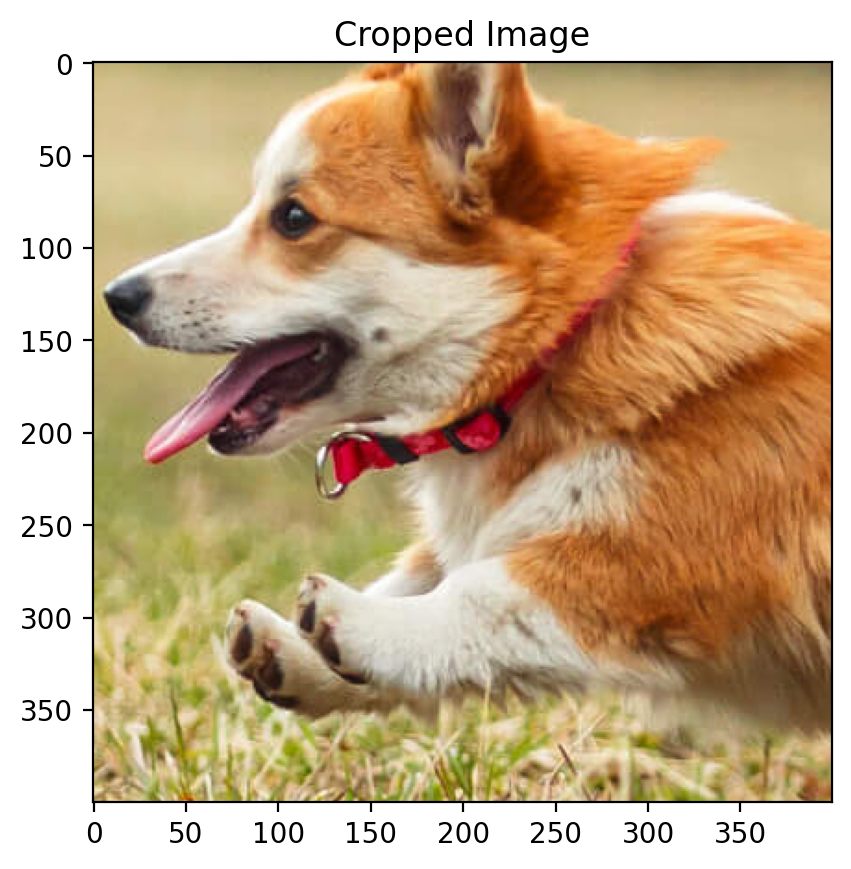
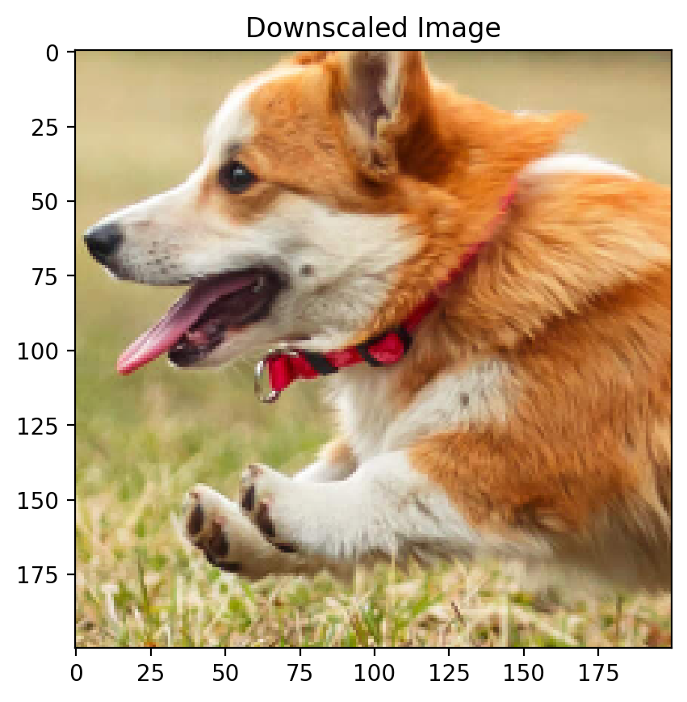
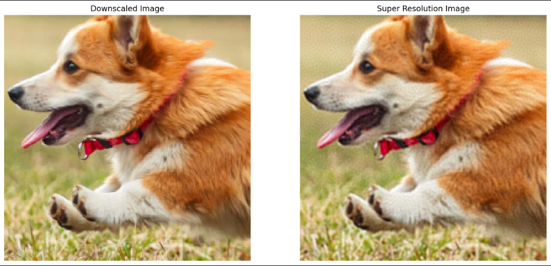

# Super-Resolution Using Random Fourier Features and Linear Regression

## Downscaling Our Original Image to get Low Resolution Input Image.
 The code performs super resolution on a given low resolution image using a Linear Regression model trained on Random Fourier Features.

 ### This is the original high resolution cropped image
 

 ### This is the corresponding lower resolution image used as the input for our model.
 

## Applying Random Fourier Features and Linear Regression

### The image generated from the model is 

This image is then compared with the ground truth to get the metrics like Root Mean squared error and signal to noise ratio.

$RMSE = 0.0261612258372829$

$SNR = 27.314144134521484$

The predicted and original images have a visible difference due to the lower number of features set due to memory and computational constraints. Higher the number of features, better it would fit be on the training data and consequently better enhanced resolution. 
